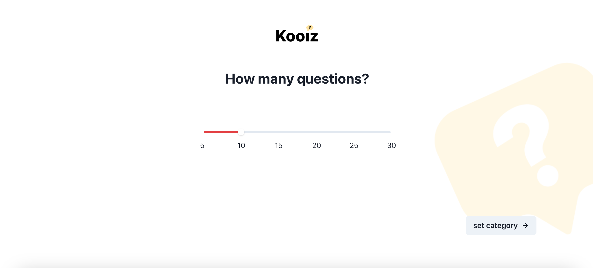
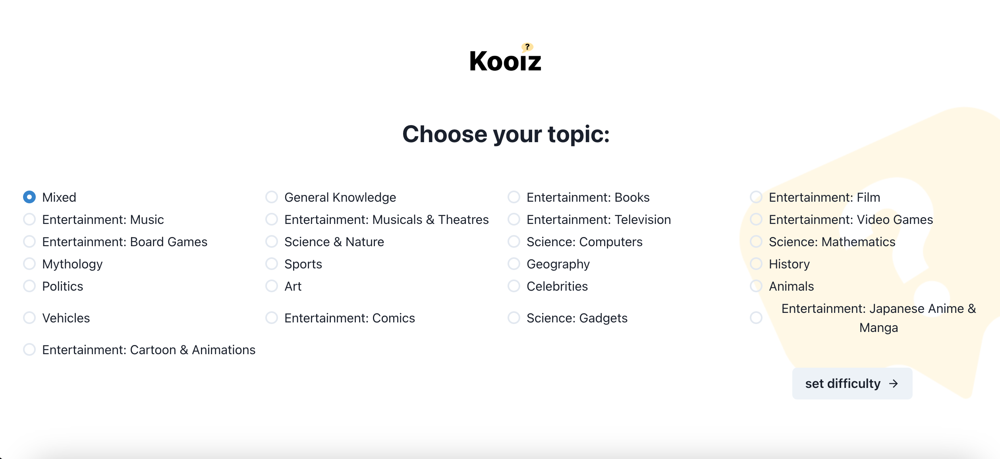
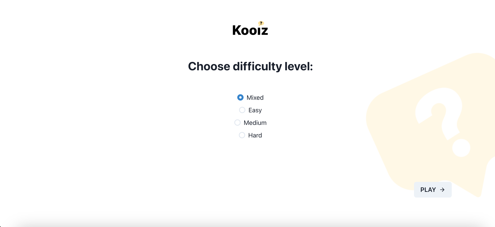

Quiz App
==========

This is a simple quiz application built using React, TypeScript, and Vite. The project is designed to test your knowledge while also showcasing modern web development practices. 
This application was created as a learning project to deepen my understanding of working with multi-page applications and various React hooks.

***

## Table of Content

* [Demo](#demo)
* [Features](#features)
* [Technologies-Used](#technologies-used)
* [Setup-And-Installation](#setup-and-installation)
* [Learning-Outcomes](#learning-outcomes)
* [Future-Improvements](#future-improvements)

***

## Demo

You can check out the live demo of the application [here](https://tanjazh.github.io/quiz-app).

***

## Features

* Multiple choice quiz questions.
* Dynamic scoring based on correct answers.
* Multiple pages for different sections of the quiz.
* State management using React hooks.
* Feedback on quiz completion with scores and correct answers displayed.
* Simple and intuitive UI design.

***

## Technologies Used

* React.
* TypeScript.
* Vite.
* React Router.
* CSS Modules.

***

## Setup and Installation

1. Clone the repository: `git clone https://github.com/tanjazh/quiz-app.git`
2. Navigate to the project directory: `cd quiz-app`
3. Install dependencies: `npm install`
4. Start the development server: `npm run dev`
5. Open your browser and navigate to http://localhost:3000 to view the app.

***

## Learning Outcomes

By building this quiz app, I focused on:
* Understanding how to structure and navigate multi-page applications in React using React Router.
* Gaining proficiency in working with React hooks like useState and useEffect to manage state and side effects.
* Learning how to integrate TypeScript into a React project for type-safe components and better development experience.
* Setting up and configuring a Vite project for faster builds and an optimized development environment.
* Exploring best practices in structuring components, managing state, and creating reusable UI elements.

***

## Future Improvements

Some areas for future enhancements include:
* Implementing a timer for each quiz question.
* Enhancing the UI/UX with animations and better accessibility.
* Saving quiz scores using local storage or integrating with a backend.

***